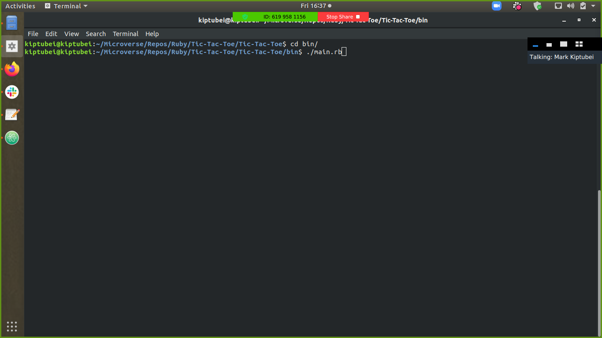
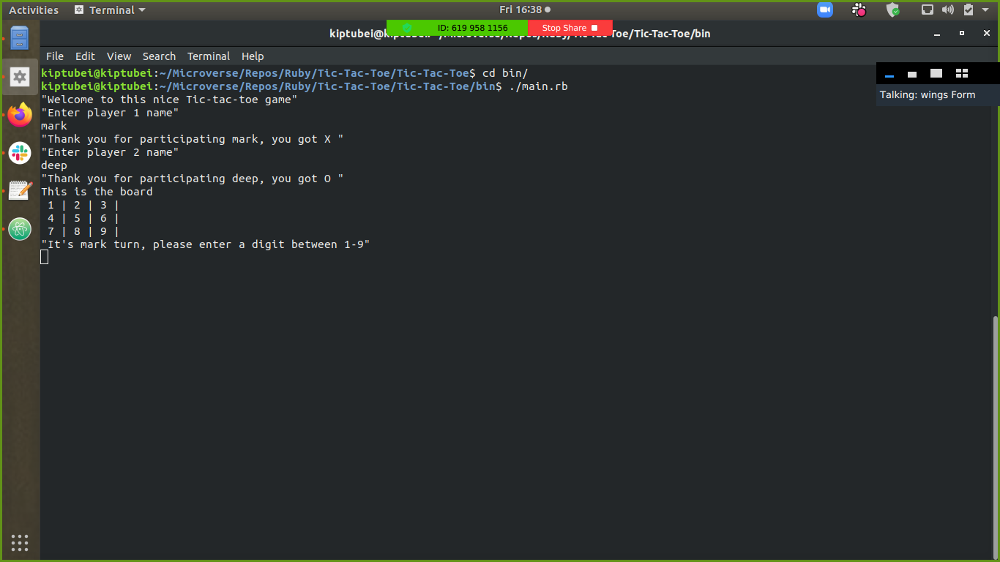
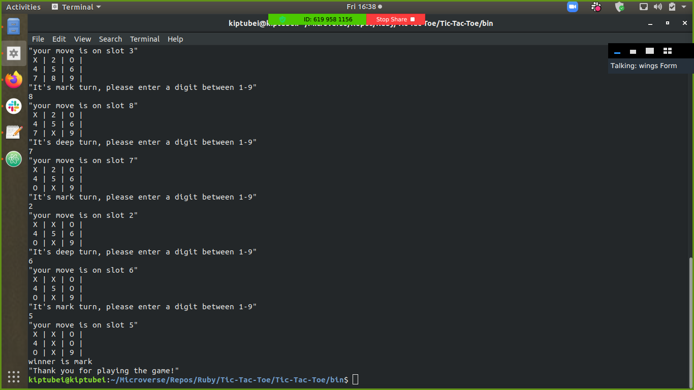

# Tic-Tac-Toe

Implementation of the tic-tac-toe game in ruby - command line. This is a two player game where one player have to put his/her pieces in a straight line either horizontally, vetically or diagonally while preventing the opponent by alligning his/her.







# Game Instructions (RULES FOR TIC-TAC-TOE)

1. The game is played on a grid that's 3 squares by 3 squares.

2. The first player is X, and the second player is O. Players take turns putting their marks in the numbered squares.

3. The first player to get 3 of her marks in a row (up, down, across, or diagonally) is the winner.

4. When all 9 squares are full, the game is over. If no player has 3 marks in a row, the game ends in a draw.


# Getting Started 🚀

These instructions will get you a copy of the project up and running on your local machine.


## How To Use 🔧

From your command line, first clone the project:

```bash
# Clone this repository
$ git clone https://github.com/kiptubei/Tic-Tac-Toe.git

# Go into the folder Tic-tac-toe where the game is present
$ cd Tic-Tac-Toe

# Navigate to bin folder
$ cd bin

# In command prompt, run the following command
$ ./main.rb

   Follow the prompts and enjoy the game!

```

## Tools and technology used

- Ruby 2.7.x
- irb


## CONTRIBUTOR

​👤 **Mark James Kiptubei**

- [Github](https://github.com/kiptubei)
- [Linkedin](https://www.linkedin.com/in/mark-james-k-aa875829/)


👤 **Dipesh Kumar**

- [Github](@Dipeshtwis)
- [Twitter](@97deepeshkumar)
- [Linkedin](https://www.linkedin.com/in/dipesh-kumar-b6ab88134/)


# Github link:

For the: [Github-link](https://github.com/kiptubei/Tic-Tac-Toe/)

## Live Demo

[Live Demo Link](https://repl.it/@dip1299/Tic-Tac-Toe#bin/main.rb)


## Show your support

Give a ⭐️ if you like this project!

## Acknowledgments

- Thanks to Microverse and The Odin Project.
